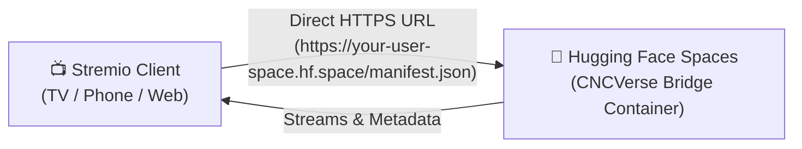

# 🎬 CNCVerse Bridge

[](https://t.me/cncverse)
[](https://huggingface.co/spaces)
[](https://buymeacoffee.com/nivincnc)

An application addon bridge that runs **Cloudstream extensions directly on Stremio, Nuvio, and all Stremio-supported platforms**.

---

## 🌟 Key Features

- **🌐 24/7 Free Cloud Hosting:** Run for free on **Hugging Face Spaces** with a direct, permanent `*.hf.space` HTTPS URL (no tunnels or banned runner cron jobs).
- **⚡ All-Platform Stremio Support:** Works seamlessly on Android TV, Google TV, FireStick, Android, iOS / iPadOS (Stremio Web), Windows, macOS, and Linux.
- **🔄 Always-On Auto Updates:** Extensions automatically update in the background whenever repository updates are released.
- **💾 Full Extension & Data Persistence:** Automatically caches and recovers all your installed `.cs3` plugins and settings across runner restarts.
- **📱 Native Android & Desktop Apps:** Run locally on your phone or PC with one-click Stremio integration.

---

## 🤗 24/7 Free Cloud Deployment via Hugging Face Spaces (Direct URL)

Host your own private CNCVerse Bridge on Hugging Face Spaces with a permanent, direct HTTPS URL — **no Cloudflare tunnel required**!



### Step 1: Create a Space on Hugging Face
1. Log into [Hugging Face](https://huggingface.co/) (create a free account if you don't have one).
2. Click **New Space** (or visit [huggingface.co/new-space](https://huggingface.co/new-space)).
3. Space Settings:
   - **Space name:** e.g. `cncverse-bridge`
   - **License / Visibility:** Choose **Public** so Stremio can reach it without authentication tokens.
   - **Select the Space SDK:** Choose **Docker** → **Blank**.
   - **Space hardware:** Free (CPU basic · 2 vCPU · 16 GB RAM).
4. Click **Create Space**.

### Step 2: Push Repository to Hugging Face
Clone your new Space repository and push this codebase (or connect your GitHub repo to the Space):
```bash
git remote add space https://huggingface.co/spaces/<your-username>/<space-name>
git push --force space main
```
*Hugging Face Spaces will automatically detect the `Dockerfile`, build it, and launch CNCVerse Bridge.*

### Step 3: Configure Extensions & Settings (Optional)
In your Space page, navigate to **Settings** → **Variables and Secrets**:
- `AUTO_INSTALL_EXTENSIONS`: *(Optional)* Comma-separated list of extensions to auto-install on startup (e.g. `SuperStream,Sorastream,SFlix` or `all`).
- `EXTENSION_SETTINGS`: *(Optional)* Paste the contents of your `ext_settings.txt` (FebBox / ShowBox tokens, concurrency).
- `CF_WORKER_URL` & `CF_WORKER_SECRET`: *(Optional)* If you also want to route through an existing Cloudflare Worker.

### Step 4: Add to Stremio
Your direct permanent Stremio Addon URL is:
```text
https://<your-username>-<space-name>.hf.space/manifest.json
```
1. Open **Stremio** on any device.
2. Go to **Addons** → Paste your URL into the search/URL bar.
3. Click **Install**. Enjoy streaming! 🍿

### 💡 Keeping your Hugging Face Space Active 24/7 (Optional)
Free Hugging Face Spaces can pause after 48 hours of inactivity. To keep your Space permanently active 24/7:
1. Create a free account on [UptimeRobot](https://uptimerobot.com/) or [cron-job.org](https://cron-job.org/).
2. Add a new HTTP monitor pointing to your Space URL:
   ```text
   https://<your-username>-<space-name>.hf.space/manifest.json
   ```
3. Set the check interval to **15 minutes**. Your space will stay awake permanently!

---

## 📱 Local Installation (Android & Desktop)

If you prefer running the bridge locally on your own devices:

### 📥 Downloads
Go to the **[Releases](../../releases)** page to download:
- **Android:** Download the `.apk` file.
- **Desktop:** Download the `.msi` or `.exe` file for Windows.

---

### Getting Started on Android

1. **Install and Run:** Install the downloaded `.apk` and open CNCVerse Bridge.
2. **Start Server:** Tap **Start Server**.
3. **Usage with Stremio:**
   - Enable the **Stremio Mode** toggle.
   - Copy the addon URL shown on screen (e.g. `http://127.0.0.1:8080/manifest.json` or your Cloudflare tunnel link).
   - In Stremio, go to **Addons** → Paste the URL → Tap **Install**.
4. **Usage with Nuvio:**
   - Keep CNCVerse Bridge running in the background.
   - Open **Nuvio** — it will auto-detect the local bridge automatically!

---

### Getting Started on Desktop (Windows)

1. Run the desktop application.
2. The server will start and display your local IP and addon URL.
3. **Same-Device Streaming:** Click **Add to Stremio** or paste `http://127.0.0.1:8080/manifest.json` into Stremio.
4. **Local Network Streaming:** Host for your TV or phone by using the local network IP shown in the app (e.g. `http://192.168.1.100:8080/manifest.json`).

---

## ⚙️ Extension Settings (`ext_settings.txt`)

You can configure provider accounts, scraper concurrency, and tokens either in the Web UI (`http://127.0.0.1:8080`) or via `ext_settings.txt` (see [`ext_settings.example.txt`](ext_settings.example.txt)):

```ini
# FebBox token for premium link resolver
token=your_febbox_token

# ShowBox / FebBox UI Token
showbox_ui_token=your_showbox_token

# Scraper Concurrency (-1 = unlimited, default = 10)
ScrapeConcurrency=10
```

---

## 💬 Support & Community

- Join our **[Telegram Group](https://t.me/cncverse)** for discussions, updates, and troubleshooting.
- If you find this project useful, consider supporting development:  
  **[☕ Buy Me a Coffee](https://buymeacoffee.com/nivincnc)**

---

## 📄 License

All rights reserved. No part of this codebase may be copied, modified, distributed, or otherwise used without explicit permission from the copyright owner.

**Note:** Files originating from the Cloudstream project retain their original licenses and copyright notices as applicable under the Cloudstream project and are not covered by this proprietary license. See the [LICENSE](LICENSE) file for more details.
