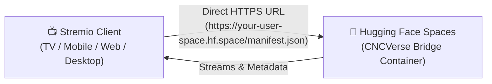

# 🎬 CNCVerse Bridge

[](https://t.me/cncverse)
[](https://huggingface.co/spaces)
[](https://www.docker.com/)
[](https://buymeacoffee.com/nivincnc)

A high-performance, standalone server bridge that runs **Cloudstream 3 extensions directly inside Stremio, Nuvio, and all Stremio-supported platforms**.

---

## 🌟 Key Features

- **🌐 24/7 Free Cloud Hosting:** Deploy for free directly on **Hugging Face Spaces** with a permanent, direct `*.hf.space` HTTPS URL — no tunnels or external cron jobs required.
- **⚡ All-Platform Stremio Support:** Works seamlessly on **Android TV, Google TV, FireStick, Android Mobile, iOS / iPadOS (Stremio Web), Windows, macOS, and Linux**.
- **🔄 Always-On Auto Updates:** Extensions automatically update in the background whenever repository updates are released.
- **🚀 Automated Extension Boot:** Auto-install extensions on startup via the `AUTO_INSTALL_EXTENSIONS` environment variable.
- **📦 Multi-Stage Docker:** Lightweight, non-root (UID 1000) containerized deployment ready for cloud or local hosting.

---

## 🤗 24/7 Free Cloud Deployment via Hugging Face Spaces

Host your own private CNCVerse Bridge on Hugging Face Spaces with a permanent, direct HTTPS URL:



### Step 1: Create a Space on Hugging Face
1. Log into [Hugging Face](https://huggingface.co/).
2. Create a new Space: [huggingface.co/new-space](https://huggingface.co/new-space).
3. Space Settings:
   - **Space name:** e.g. `cncverse-bridge`
   - **License / Visibility:** **Public** (so Stremio can load the manifest without auth tokens).
   - **SDK:** **Docker** → **Blank**.
   - **Hardware:** Free (**CPU basic · 2 vCPU · 16 GB RAM**).
4. Click **Create Space**.

### Step 2: Push Repository to Hugging Face
Push this repository directly to your Space:
```bash
git remote add space https://huggingface.co/spaces/<your-username>/<space-name>
git push --force space main
```
*Hugging Face will automatically build the `Dockerfile`, compile the Kotlin JVM server, and launch the container on port 7860.*

### Step 3: Configure Environment Variables (Optional)
In your Space page, navigate to **Settings** → **Variables and secrets**:

| Variable / Secret | Example Value | Description |
|---|---|---|
| `GITHUB_TOKEN` *(Secret, Recommended)* | `ghp_...` | GitHub Personal Access Token (with `repo` scope). **Enables 100% automated 24/7 cloud sync** — saves all installed extensions, settings, and repos to your `bridge-data` branch and restores them on boot! |
| `AUTO_INSTALL_EXTENSIONS` | `all` or `SuperStream,Sorastream` | Comma-separated list of extensions to automatically install on container boot (`all` installs all repo plugins). |
| `EXTENSION_SETTINGS` | *(contents of ext_settings.txt)* | Provider tokens (FebBox / ShowBox tokens) and scraper concurrency (copyable with 1 click from Dashboard). |
| `REPO_URLS` | `https://raw.githubusercontent.com/...` | Custom Cloudstream repository URLs to load extensions from. |
| `PORT` | `7860` | Server listening port (defaults to `7860` on Hugging Face). |

### Step 4: Add to Stremio
Your direct permanent Stremio Addon URL is:
```text
https://<your-username>-<space-name>.hf.space/manifest.json
```
1. Open **Stremio** on your TV, phone, PC, or Web.
2. Go to **Addons** → paste your URL into the addon search bar.
3. Click **Install**. Enjoy streaming! 🍿

### 💡 Keeping your Hugging Face Space Active 24/7 (Free)
Free Hugging Face Spaces go to sleep after 48 hours of inactivity. To keep your Space awake permanently:
1. Create a free account on [UptimeRobot](https://uptimerobot.com/) or [cron-job.org](https://cron-job.org/).
2. Create an **HTTP monitor** pointing to:
   ```text
   https://<your-username>-<space-name>.hf.space/manifest.json
   ```
3. Set the check interval to **15 minutes**. Your space will remain active 24/7!

---

## 💻 Local & Self-Hosted Deployment

### Option A: Run with Docker
```bash
# Build the Docker container
docker build -t cncverse-bridge .

# Run container (port 7860, auto-install all plugins)
docker run -d \
  -p 7860:7860 \
  -e AUTO_INSTALL_EXTENSIONS=all \
  --name cncverse-bridge \
  cncverse-bridge
```
Access the addon manifest at `http://127.0.0.1:7860/manifest.json`.

### Option B: Run with Gradle / JVM directly
Requirements: JDK 17+
```bash
# Build the distribution
./gradlew installDist

# Run the server
PORT=7860 ./build/install/cncverse-bridge/bin/cncverse-bridge
```

---

## ⚙️ Extension Settings (`ext_settings.txt`)

You can configure provider accounts, scraper concurrency, and tokens via `ext_settings.txt` (see [`ext_settings.example.txt`](ext_settings.example.txt)):

```ini
# FebBox token for premium link resolver
token=your_febbox_token

# ShowBox / FebBox UI Token
showbox_ui_token=your_showbox_token

# Scraper Concurrency (-1 = unlimited, default = 10)
ScrapeConcurrency=10
```

---

## 💬 Support & Community

- Join our **[Telegram Group](https://t.me/cncverse)** for discussions, updates, and troubleshooting.
- If you find this project useful, consider supporting development:  
  **[☕ Buy Me a Coffee](https://buymeacoffee.com/nivincnc)**

---

## 📄 License

All rights reserved. No part of this codebase may be copied, modified, distributed, or otherwise used without explicit permission from the copyright owner.

**Note:** Files originating from the Cloudstream project retain their original licenses and copyright notices as applicable under the Cloudstream project and are not covered by this proprietary license. See the [LICENSE](LICENSE) file for more details.
